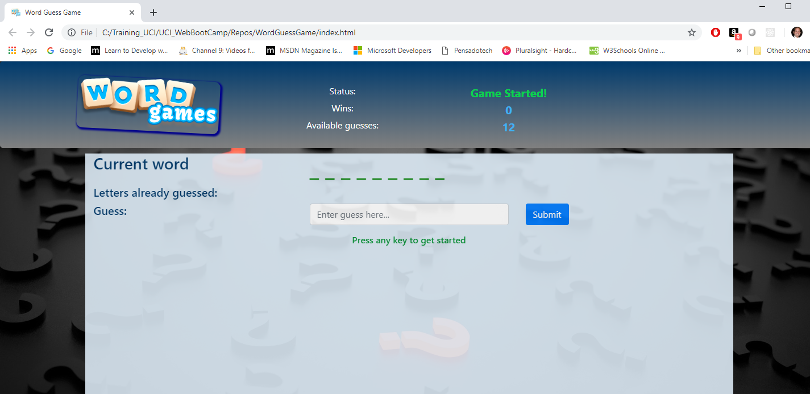

# WordGuessGame

Word Guess Game similar to the Hangman game, but without anyone getting hanged.

_by Armando Pensado_

## Description

This project is a game to guess secret words. The application has an array of words and one is selected at random and presented to the player for guessing. The player needs to guess the word one letter at a time. There is a maximum of twelve failed guess.

The player wins if can guess successfully complete the word, or losses if it runs out of failed guesses.

## Who can benefit from this application

This project is a good example for beginner web developers that are learning HTML, CSS, and JavaScript. 

## How developers can get started

The developer is welcome to clone or download the project to the personal device. The project can be executed in any browser, and can be visualized using MS Visual code. 

There is not specials initialization instructions, as it is plain HTML, CSS, and JavaScript. 

## Who maintains and contributes to the project

This is a project for our personal learning process.

## Where users can get help with the project

* JavaScript : MDN https://developer.mozilla.org/en-US/docs/Web/JavaScript
* w3schools JavaScript tutotials : https://www.w3schools.com/js/
* w3schools HTML tutorials : https://www.w3schools.com/html/default.asp
* w3schools CSS tutorials : https://www.w3schools.com/css/default.asp