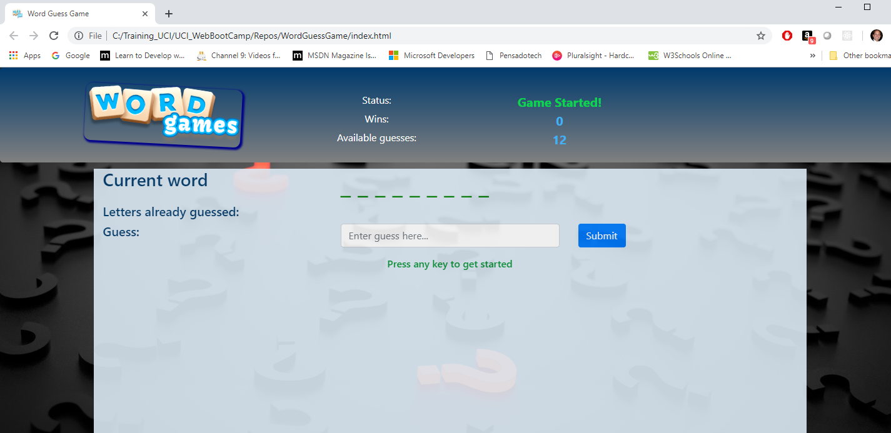
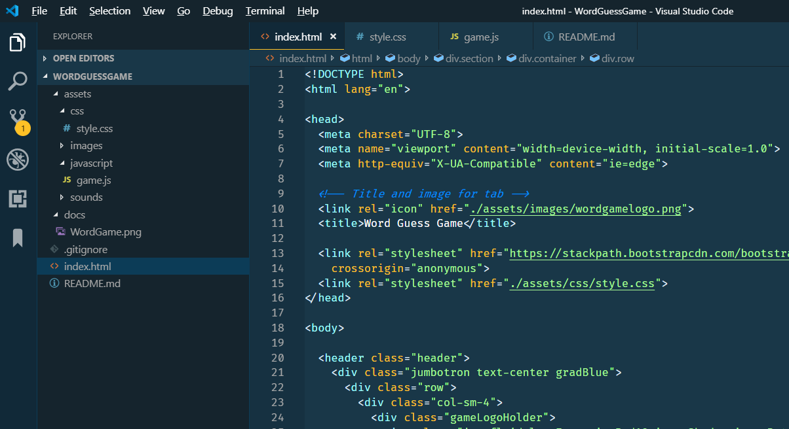

# WordGuessGame

Word Guess Game is a browser-based word guessing game inspired by Hangman, but without the hanging.

_by Armando Pensado_

## Overview

This project is a simple web game in which a secret word is chosen at random from a predefined list. The player must guess the word one letter at a time, with a maximum of 12 incorrect attempts before the round ends.

The player wins by completing the word correctly. If the guess limit is reached, the game ends in a loss. As the user enters letters, the interface provides feedback for successful guesses, incorrect guesses, and repeated entries.

Play online: https://pensadotech.github.io/WordGuessGame/

## Features

- Random word selection from a curated list
- Letter-by-letter guessing gameplay
- Maximum of 12 failed attempts
- Tracking of previously guessed letters
- Feedback for correct, incorrect, and repeated input
- Simple browser-based interface built with HTML, CSS, and JavaScript
- Score tracking for total wins across rounds

## Who this is for

This project is an approachable example for beginner web developers learning HTML, CSS, and JavaScript. It demonstrates core front-end concepts such as DOM updates, event handling, arrays, game state management, and conditional logic in a compact, easy-to-follow application.

## Getting started

You can run the project locally by cloning or downloading the repository and opening the app in a browser. There are no special setup requirements because it is a plain HTML, CSS, and JavaScript project.

### Quick start

1. Clone or download the repository.
2. Open the project folder in your editor, such as Visual Studio Code.
3. Open `index.html` in a browser, or serve the project locally from the repository root.
4. To play online immediately, visit: https://pensadotech.github.io/WordGuessGame/
5. Start typing a letter to begin guessing. Press `Enter` to start a new round after a game ends.

### Project structure

The core gameplay logic lives in JavaScript, where `wordGuessGame` manages the game state and `wordGenerator` selects a random word.

- `index.html` — page layout and UI structure
- `assets/css/style.css` — styling for the game interface
- `assets/javascript/game.js` — game logic and user interaction
- `assets/images/wordgamelogo.png` — application logo
- `docs/WordGame.png` — main game screenshot
- `docs/WordgameLayout.png` — project layout reference

The repository layout should resemble the structure below after cloning.

## How the game works

- A random word is selected from a predefined array.
- The hidden word is displayed as placeholders, such as underscores.
- The player guesses one letter at a time.
- Correct letters are revealed in their matching positions.
- Incorrect guesses reduce the remaining attempts count.
- Repeated guesses are flagged and ignored.
- The game ends when the word is solved or the player runs out of chances.

## Key takeaways

This project is a useful learning exercise for understanding how lightweight browser games are built without frameworks or libraries. It highlights several practical front-end patterns:

- Manipulating the DOM to reflect game state
- Using arrays and string operations to model gameplay
- Responding to keyboard and button events
- Tracking progress and validation rules in JavaScript
- Creating a small interactive application with clean separation of structure, styling, and behavior

## Maintenance and contribution

This project is part of the author's personal learning process and serves as an example of foundational web development in practice.

## References and further reading

These resources provide helpful context for the technologies and concepts used in the project:

* JavaScript: MDN — https://developer.mozilla.org/en-US/docs/Web/JavaScript
* JavaScript tutorial: W3Schools — https://www.w3schools.com/js/
* HTML tutorial: W3Schools — https://www.w3schools.com/html/default.asp
* CSS tutorial: W3Schools — https://www.w3schools.com/css/default.asp

For developers looking to build on this project, these topics are worth exploring next:

- DOM events and event listeners
- Arrays, objects, and game state patterns
- Input validation and error handling
- Creating reusable functions for UI updates
- Basic browser-based game design and user feedback